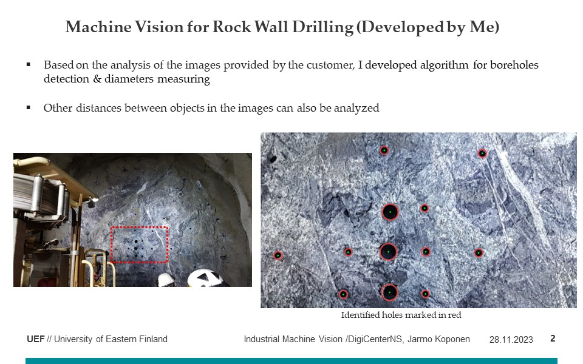

Welcome to my portfolio!
I am Jarmo Koponen, and I am currently working as a doctoral reseacher at University of Eastern Finland. 
I am proud to share with you a few of my most significant achievements related to the topic of my dissertation and machine vision methods.

I take pride in being the lead author of three peer-reviewed publications (PhDPublications.md) centered around the subject of my dissertation. In these publications, I introduced a novel method to address previously unsolved problems, resulting in significant advancements in the field. These accomplishments are the outcomes of extensive and dedicated work, duly recognized by the research community.

Furthermore, through my involvement in the ERDF-supported Regional Council of Pohjois-Savo DigiCenterNS project, I developed an innovative machine visionfor accurately identifying the sizes and positions of holes drilled in rock walls. This groundbreaking approach has enhanced efficiency and precision in the field of rock engineering, showcasing my capacity to apply my machine vision expertise to practical challenges.

In terms of education, I have completed a master's degree in software engineering, specializing in machine vision, deep learning, and pattern recognition. I received a diploma with commendable grades. Additionally, I have earned a Bachelor of Science degree in software engineering with a minor in electrical and automation engineering. My background as an automation engineer and electrician has provided me with a solid technical foundation that I have been able to apply in my research.

I am passionate about my research work and motivated to continue solving new challenges in machine vision, pattern recognition, and deep learning. I am open to connections and opportunities that can further enhance my skills and contribute value to the field's development.

Thank you for reviewing my portfolio, and I look forward to future opportunities and collaborations!

My Research Skills: Combining Scholarly Insight with Industrial Machine Vision Expertise

My research expertise is a fusion of the ability to effectively review literature related to my field, coupled with the application of the latest methods. This is complemented by my extensive hands-on experience with industrial machine vision systems. This unique combination enables me to integrate state-of-the-art machine vision techniques with a profound understanding of the critical properties of the objects under observation, which is essential in addressing complex research problems.

[PhD publications]
Peer-Reviewed Publications Written During My Doctoral Research
- Binarization method for text printed on variably curved surfaces of pharmaceutical packages. Published at the Electronic Imaging Conference 2021.
- Deep Learning Machine Vision, high-precision recognition of pharmaceutical packaging markings (Peer Review in Progress). Published at the 2023 F1000 Forum.
- Post-processing of deep learning methods (Not Yet Published).

[Machine Vision R&D](MachineVisionRD.md)
- Research and development tasks on computer vision-based identification of medication packages located partially or completely stacked on top of each other in the Fixu pharmacy dispensing machine.

[Sensor Development Specialist](SensorDevelopmentSpecialist.md)
- Development of a vibration measurement sensor using new technology.
- Developed the installation method for a LevelSense tomography analyzer and was responsible for the electrical design and product development of a new technology carbon content analyzer.

[ProjectModelDevelopmentProjectManager](ProjectModelDevelopmentProjectManager.md)
- Development tasks of the elemental analyzer turnkey project model resulted in the development of a tool for calculating installation costs in turnkey projects.
- Training and Development: I provided user training for proposal managers, sales managers, and account managers on the utilization of the calculator tool, receiving feedback such as "going on the top trainings in Outotec all the time."

[ACT Trainer](ACTTrainer.md)
- Active role in conducting product training sessions for the Outotec ACT system.

[WIS Electrical Designer](WISelectricalDesigner.md)
- Designed and installed the electrification of a product development laboratory and conducted verification checks.

[ACT Techical Support Engineer](ACTTechnicalSupportEngineer.md)
- Responsible for providing global technical support for the Outotec ACT system (Advanced Process Control), which entailed the productization of the system, the creation of maintenance guidelines, and the development of the spare parts operations. Additionally, I played an active role in conducting product training sessions for the Outotec ACT system.

[WIS Field Support Engineer](WISFieldSupportEngineer.md)
- Responsible for Measurex WIS system commissioning support, system updates, and troubleshooting. My job has required good written and oral English skills, as well as readiness to travel at short notice?

[SAP Implementation Lead](SAPImplementationLead.md)
- SAP Implementation Lead Customer Solutions Center, SAP system implementation at Honeywell's manufacturing facility Nordics. Integrating the SAP system with the factory's operations. DCS project manager tasks include order reception, budgeting, goods ordering and receipt, DCS system manufacturing, and delivery to the EMEA region.

[DCSProjectManager](DCSProjectManager.md)
- DCS project manager, purchase orders reception, budgeting, goods ordering and receipt, DCS system manufacturing, and delivery to the EMEA region.

[WISLeadEngineer](WISLeadEngineer.md)
- Honeywell OEM Cognex WIS camera systems contract manufacturing for customized systems to end customers. I was responsible for applications, project management, and technical support. Computer assemblies and software were configured according to customer specifications. The systems were set up and tested, and the functionality of optical configurations was verified. Before shipment, FAT (Factory Acceptance Testing) tests were conducted with the end customer.

[WIS Delivery Manager](WISDeliveryManager.md)
- I was responsible for the comprehensive delivery of WIS systems, from defining the System Descriptions with customers, acting as an expert in the procurement department, providing global sales support, leading electrical and mechanical design teams, integrating customer systems, conducting operational testing, and carrying out FAT (Factory Acceptance Testing) with end customers.

[Electrician](Electrician.md)

- Installation team senior member, manufacturing, testing, and commissioning of Honeywell (formerly Altim Control) automation systems. I was in charge of manufacturing highly demanding electronic control systems for use in special applications.
- Alcont DCS power supply cabinets, cross connection cabinets, and electronic cabinets mechanical and electrical installations, with verification inspections, field installations, Oulu, Pietarsaari, Sunila, Äänekoski, Kaskinen.
- Electrical installations for electric heating houses, electrical work for electric boilers, electric saunas, and motor electrification.
- Installation of electric heating systems in detached houses, electrical work during the construction of new detached houses. Electrical work for apartment buildings and industrial facilities.
